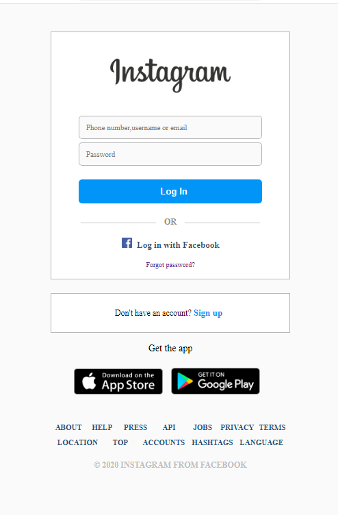

# Planering

### Uppgift: Instagram BruteForce

**Av: Max Wigstein**

**_Beskrivning utav uppgiften:_**

Målet går ut på att du ska **"hacka"** dig in på _**Instagrams**_ inloggnings sida. Sidan som ska hackas kommer vara en replika gjord utav mig själv, och som är gjord i HTML, CSS och Javascript. Hemsidan är kopplad till **Firebase** där **lösenord** och **användarnamn** till "användare" kommer att finnas **lagrade** i krypterat format (**key:value** format). **Målet** är att du ska lyckas få tillgång till denna data och avkryptera datan för att sedan ta dig in på ett utav de 5 kontona.

Jag valde att göra uppgiften på detta sätt för att visa vad det kan finnas för svagheter när man väljer att göra ett login system som är client baserat.

    

    
    

## Tänkt lösning:

### Steg 1:

    
    

Här kan man se att det finns en fil som heter **firebase.js**, som man kan anta har att göra med någon koppling till Firebase att göra. Läser man igenom koden så kan man se att koden verkar hämta ner användarnamn och lösenord i **key:value** format vilket man också får som leddtråd i kommentarerna. Användarnamen verkar lagras i en variabel som heter **usernameInBase32**, vilket ska avslöja att användarnamnen på databasen är konverterade till **bas32**. Så genom att exempelvis **avkommentera** delen i koden där varje par skrivs ut i konsolen varje gång denna funktion körs (när denna körs vet vi inte än), så går det att **kopiera de krypterade användarnamnen** och lägga in i en **bas32 avkodare**. En så länge vet vi inte i vilket format lösenorden är krypterade, bara att de verkar vara krypterade, vilket syns på variabelnamnet.

    
    

Här kan vi se **printen** i konsolen (Vi vet som sagt fortfarande inte när funktionen som printar dessa körs, utav man får testa sig fram) (Den körs när man trycker på knappen "Log in"). De **rödmarkerade** är **användarnamnen i Bas32** och de som är **markerat i gult** är de **krypterade lösenorden till varje användarnamn**.

    
    

Här kan vi se att om vi tar det **tredje** användarnamnet i listan och klistrar in i en **bas32 decoder** så kan vi se att användarnamnet är **SunsetDreamer**.

### Steg 2:

    
    

Om vi går in och kollar i filen som heter **passwordEncrypter.js** så kan vi se hur lösenords-krypteraren verkar vara uppbygd. Här gäller det att inse att denna kryptering inte är en kryptering som går att avkryptera då den använder en **Hash-kryptering**, dvs en **icke avkodningsbar algorithm**. Så det finns inte jätte mycket att göra här förutom att vi måste inse att vi inte ska lägga någon tid på att försöka avkoda lösenordet.

### Steg 3:

    
    

Om vi kollar i filen som heter **StoredPasswords.txt** så kan vi anta att om vi tar någon av alla dessa lösenord och **kör dessa igenom krypteringsfunktionen** så bör vi bland annat **få fram de lösenord som matchar dom krypterade lösenorden som hör ihop med användarnamnen**.

### Steg 4:

    
    

Här har vi ett **exempel projekt** där jag **kopierat filen med de lagrade lösenorden** och skrivit ett **program som går igenom varje rad i filen**, och kör den igenom **samma krypteringsfunktion** som i uppgiften (har bara kopierat den). Sedan outputar denna kod alla lösenord men krypterade igenom funktionen i en ny fil som heter **encrypted.txt**.

Vad vi nu kan göra är att vi **kopierar det krypterade lösenordet som tillhörde användarnamnet SunsetDreamer** dvs **par nummer 3, i steg 1 på bilden** som visar **konsolen**. Sedan går vi in i filen där vi har krypterat alla sparade lösenord och använder **Ctrl + f** för att **söka i filen** med promten: **4b0e76ace2f18d1bcd2797841d5cb4818321c36ae769005fe72026766e7c7f60**.

    
    

Vi ser att **lösenordet** ligger på rad: **98003**

    
    

Om vi tar och kollar vad som gömmer sig på **samma rad (98003)** i filen med "Instagrams sparade lösenord" så hittar vi: **277rte87hryloitru**

### Steg 5:

    
    

Så om vi nu tar och matar in ex: användarnamnet: **SunsetDreamer** ihop med lösenordet: **277rte87hryloitru**, hittar vi flaggan! **Flagga: 210s{Insta}**

### Svårhetsgrad:

Jag tror att **svårhetsgraden** ligger på **0.4 - 0.5**, dvs att målet är att **cirka hälften** ska kunna lösa uppgiften. Det som gör att många kan lösa uppgiften är för att den inte är så värst komplicerad om man bara inser hur man ska göra, dvs **upptäcka variabel namnen** och **filen med lösenord** för att sedan kunna **avkoda dessa**. Samtidigt så finns det andra sätt att klara uppgiften om man är duktig på att förstå koden. Då själva inloggningen sker på clienten så görs även valideringen där. Vilket innebär att man skulle kunna sätta valideringen till true direkt om man lyckas hitta vart detta görs. Alla kommer inte att klara uppgiften då det kan vara lite knepigt att navigera sig runt i koden om man känner sig osäker på vad saker gör.

## Planering vs Final Product

Planeringen och den slutgiltliga produkten skiljer sig inte mycket ifrån. Jag gjorde en ganska genomtänkt planering så jag byggde efter den vilket resulterade i att uppgiften blev snarlik planeringen. Det enda som jag ändrade lite var att man istället för att **avkoda** lösenorden (insåg att det var omöjligt) skulle testa sig fram med lösenord tills att efter att de krypterats, matchade den krypterade verisionen på firebase, plus att jag ändra formatet på användarnamnen till bara bas32 istället för en kombination av olika baser.
