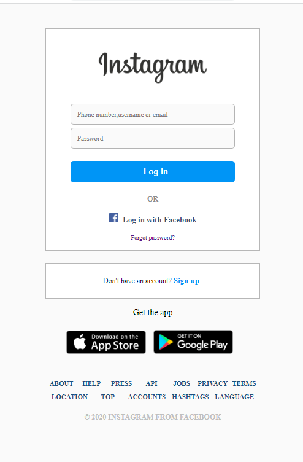
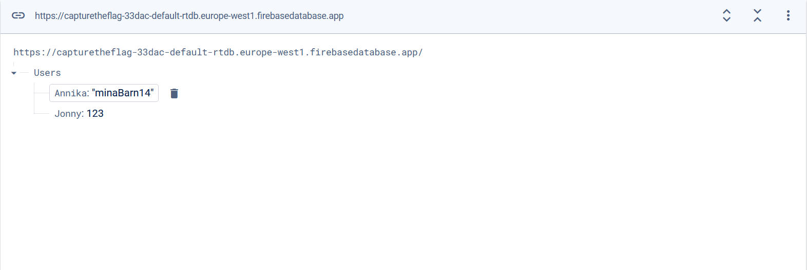

# Planering

### Uppgift: Instagram BruteForce

**Av: Max Wigstein**

**_Beskrivning utav uppgiften:_**

Målet går ut på att du ska **"hacka"** dig in på _**Instagrams**_ inloggnings sida. Sidan som ska hackas kommer vara en replika gjord utav mig själv och som är gjord i HTML, CSS och Javascript. Hemsidan är kopplad till **Firebase** där **lösenord** och **användarnamn** till "användare" kommer att finnas **lagrade** i krypterat format. **Målet** är att du ska lyckas få tillgång till denna data och avkryptera datan för att sedan ta dig in på ett utav kontona.

    

    
    

**Obs! Allt under Users kommer att vara krypterat under uppgiften**

## Grov lösning:

För att lösa uppgiften så är tanken att genom **tillgång till hela koden**, kunna **avläsa koden** och inse i vilken variabel som datan ifrån Firebase sparas. Det kommer även att finnas **en variabel** där bara **användarnamnen** sparas, och **namnet på denna variabel** kommer att avslöja vilken **avkodning** som krävs för att få fram ett **avkodat** användarnamn. **Lösenordet** kommer också att vara krypterad när det lagras i en variabel, men den **krypteringen kommer inte att framgå**. Däremot så kommer det ligga en **fil** i projektet med **_"Instagrams lagrade lösenord"_**. Man ska sedan skriva ett **litet script** för att kunna testa **ALLA lösenord** i filen och kolla om de **matchar** med användarnamnet. När du väl kommer in på sidan har du klarat uppgiften och hittat **flaggan**.

### Svårhetsgrad:

Jag tror att **svårhetsgraden** ligger på **0.4 - 0.5**, dvs att målet är att **cirka hälften** ska kunna lösa uppgiften. Det som gör att många kan lösa uppgiften är för att den inte är så värst komplicerad om man bara inser hur man ska göra, dvs **upptäcka variabel namnen** och **filen med lösenord** för att sedan kunna **avkoda dessa**. Alla kommer inte att klara uppgiften då det kan vara lite knepigt att navigera sig runt i koden om man känner sig osäker på vad saker gör.
